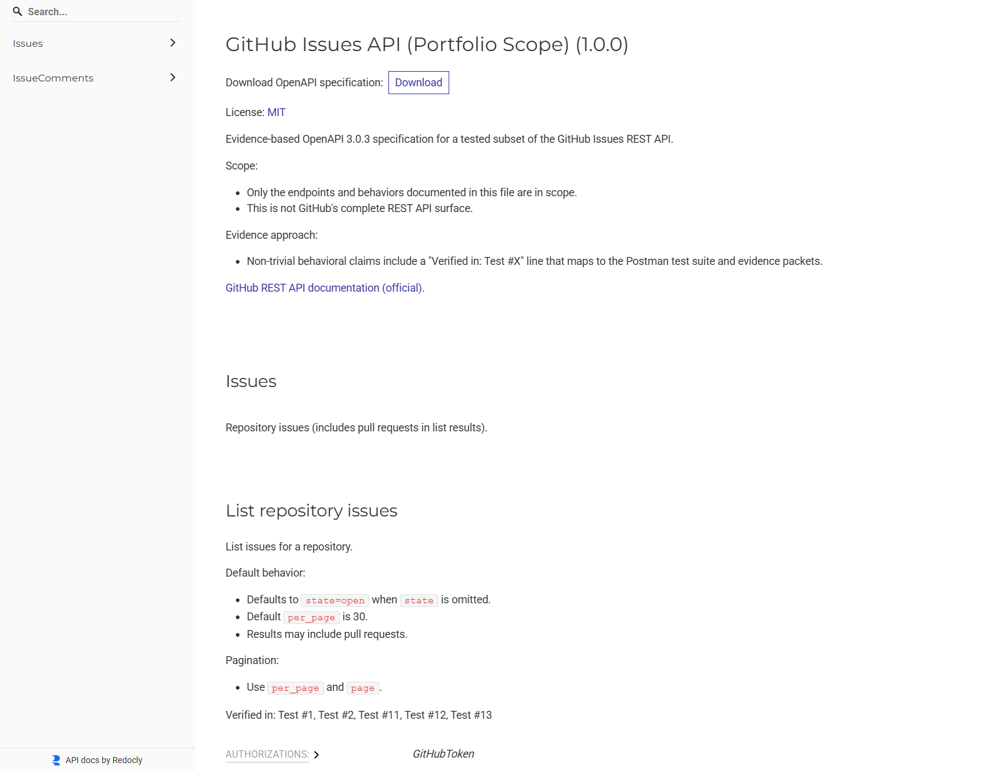
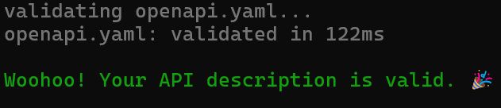

# GitHub Issues REST API Portfolio (Evidence-Based OpenAPI 3.0.3)

Evidence-based OpenAPI 3.0.3 specification for a tested subset of the GitHub Issues REST API.
Every non-trivial behavior claim is backed by a Postman test and saved request/response evidence (ET timestamps in filenames).

- Base URL: `https://api.github.com`
- Spec file: `openapi/openapi.yaml`
- Redocly config: `openapi/redocly.yaml`



## Live docs

- Hosted (GitHub Pages): [View live docs](https://derrickscottux-collab.github.io/github-issues-openapi-portfolio)
- Local build output: `docs/index.html`

## Scope

This is intentionally not a full GitHub REST API spec. This repo documents only the endpoints and behaviors verified by the included tests and evidence.

### Endpoints included (tested scope)

Issues
- `GET /repos/{owner}/{repo}/issues` (List repository issues)
- `POST /repos/{owner}/{repo}/issues` (Create an issue)
- `GET /repos/{owner}/{repo}/issues/{issue_number}` (Get an issue)
- `PATCH /repos/{owner}/{repo}/issues/{issue_number}` (Update an issue)

Issue comments
- `GET /repos/{owner}/{repo}/issues/{issue_number}/comments` (List comments on an issue)
- `POST /repos/{owner}/{repo}/issues/{issue_number}/comments` (Create a comment on an issue)
- `GET /repos/{owner}/{repo}/issues/comments/{comment_id}` (Get an issue comment)
- `PATCH /repos/{owner}/{repo}/issues/comments/{comment_id}` (Update an issue comment)
- `DELETE /repos/{owner}/{repo}/issues/comments/{comment_id}` (Delete an issue comment)

## Evidence and traceability

### How to interpret "Verified in: Test #..."

In OpenAPI descriptions you may see lines like:
`Verified in: Test #X`

Meaning:
1) The behavior was observed and recorded during Test #X in the test suite
2) Supporting request/response evidence is captured in `evidence/raw/`
3) The OpenAPI description was updated to match that verified behavior

### Where to find the proof

- Test suite: `tests/github_api_test_suite.md`
- Evidence package:
  - `evidence/README.md`
  - `evidence/EVIDENCE_MATRIX.md`
  - `evidence/TRACEABILITY_MAP.md`
  - `evidence/manifest.json`
  - Raw response artifacts: `evidence/raw/`

## Tooling used

- Postman (manual execution; saved examples and exported evidence)
- Redocly CLI (linting and HTML documentation build)

No secrets (PAT tokens) are stored in this repository.

## Validate (lint) the OpenAPI file

From repo root:

```bash
npx @redocly/cli@latest lint openapi/openapi.yaml --config openapi/redocly.yaml
```



### Note on ambiguous paths

GitHub’s Issues API includes endpoints that some linters treat as ambiguous due to overlapping route templates (for example, the issue comments routes).
For this portfolio repo, the Redocly `no-ambiguous-paths` rule is disabled in `openapi/redocly.yaml` to avoid a known false-positive warning while keeping the spec OpenAPI 3.0.3 compliant and stable.

## Render docs locally (HTML)

### Option A (macOS/Linux/Git Bash)

```bash
mkdir -p docs
npx @redocly/cli@latest build-docs openapi/openapi.yaml --config openapi/redocly.yaml -o docs/index.html
```

### Option B (Windows PowerShell)

```powershell
New-Item -ItemType Directory -Force -Path docs | Out-Null
npx @redocly/cli@latest build-docs openapi/openapi.yaml --config openapi/redocly.yaml -o docs/index.html
```

Then open:
- `docs/index.html`

If GitHub Pages tries to process it as Jekyll, add an empty file:
- `docs/.nojekyll`

## Publish docs (GitHub Pages)

1) Generate `docs/index.html` (see command above)
2) Commit and push the `docs/` folder
3) GitHub repo: Settings -> Pages
   - Source: Deploy from a branch
   - Branch: `main`
   - Folder: `/docs`
4) Copy the published Pages URL into the "Live docs" section above

## Repo layout

- `openapi/openapi.yaml` - OpenAPI 3.0.3 spec
- `openapi/redocly.yaml` - Redocly lint/build config
- `tests/github_api_test_suite.md` - test definitions and verification notes
- `evidence/` - evidence indexes, traceability map, and raw response artifacts
- `docs/index.html` - generated HTML docs (commit for GitHub Pages hosting)
- `assets/` - screenshots (for README visuals)

## Disclaimer

This is an independent portfolio project and is not an official GitHub specification.
For full coverage, refer to GitHub’s official REST API documentation.
